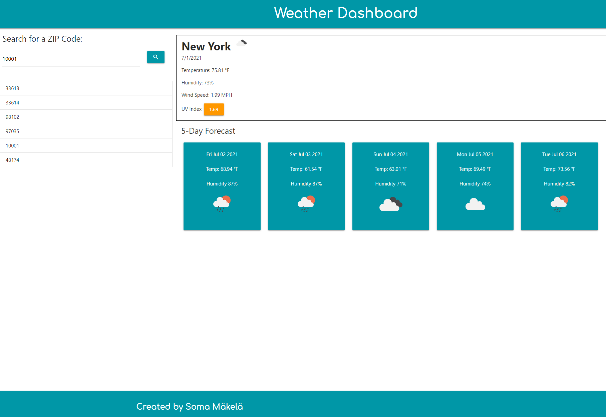

# Weather Dashboard

## Table of Contents

* [Description](#description)
* [Usage](#usage)
* [Credits](#credits)
* [License](#license)

## Description

Do you need to get accurate weather information easily? Do you want your previously searched locations to be one click away? 

With this weather application, you can get it all! 

This website allows you to view current weather conditions for the ZIP code of your choice. This information includes: an icon representing the weather conditions, the temperature, the humidity, the wind speed, and the UV index. The UV index will tell you at-a-glance if conditions are favorable, moderate, or severe.

In addition to that, you will also be shown a 5-day forecast for the city allowing you to view the temperature, humidity, and an icon representing the weather conditions for that day. The ZIP code will be stored on a sidebar allowing you to easily return to the weather forecast for the location of your choice.

Be sure to keep an umbrella and some sunscreen on hand! You never know what the forecast might be.

This weather dashboard is written in jQuery, JavaScript, HTML, MaterializeCSS, and custom CSS. It uses the [OpenWeather API](https://openweathermap.org/api) to retrieve weather data for cities.

## Usage

Navigate to [Soma Mäkelä's Weather Dashboard](https://smakela13.github.io/weather-dashboard/index.html) and view the web page.

## Credits

Created by [Soma Mäkelä](https://github.com/smakela13).

## License

This website currently has No License, which means it is under exclusive copyright. No one can copy, distribute, or modify this website without permission.
